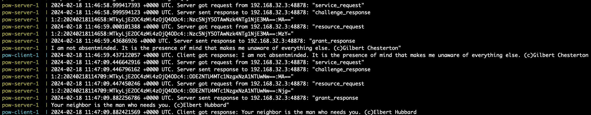

### TCP-server based on Proof of Work

The server can implement some algorithm to make DDOS more expensive and meaningless to provide DDOS protection.
To do this the server will allow access only after the client solved some task.

This example implements the Hashcash algorithm. This algorithm does not impose a big CPU cost on the server and is easily configurable to provide flexible complexity on the client side.

Initially, Hashcash was designed to use the SHA1 algorithm but it has been compromised so SHA256 is used in this implementation

### How it works
The random quote will be obtained from https://zenquotes.io after the client solves the challenge and the server allows access to the resource

### Requirements

1. [Go 1.21](https://tip.golang.org/doc/go1.21)
2. [Docker](https://docs.docker.com/get-docker/)

### How to run server and client
```
git clone git@github.com:dolbik/pow.git
cd pow
docker-compose up
```
### How to run tests
```
git clone git@github.com:dolbik/pow.git
cd pow
go mod download
go test ./...
```

### Results



